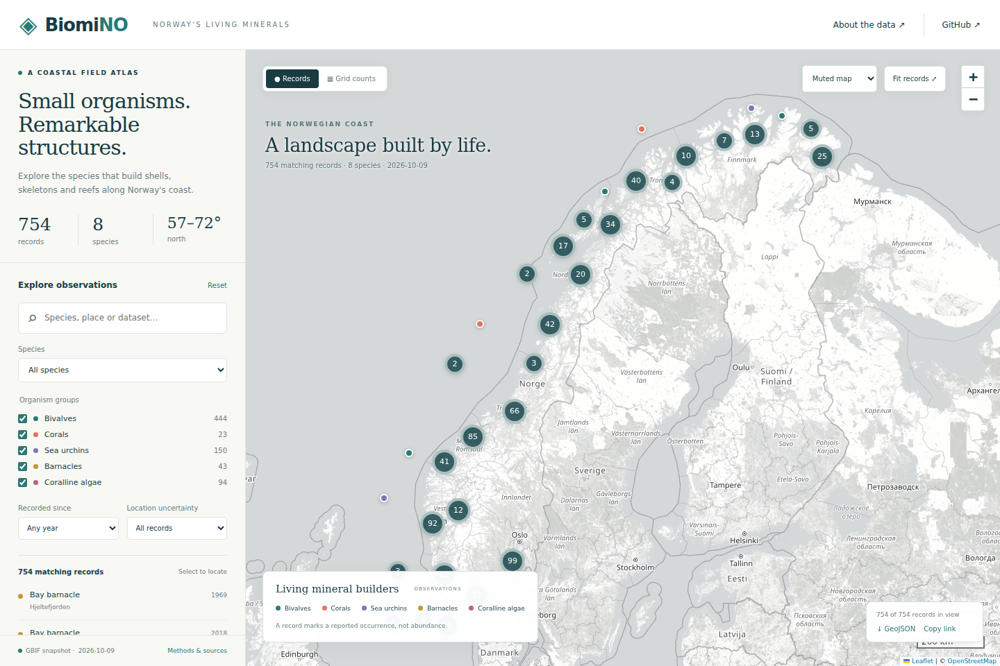

# BiomiNO

An interactive map of shell-building and calcifying marine species along Norway's coast, built with Python and Leaflet.



## Features

- Search records by species, place, recorder or dataset.
- Filter by organism group, year and coordinate uncertainty.
- View clustered observations or record counts in a geographic grid.
- Open original records and dataset citations from the map.
- Export filtered records as GeoJSON or share a link to the current filters.

## Getting started

Open [BiomiNO_map.html](BiomiNO_map.html) directly in a browser, or run it locally:

```bash
git clone https://github.com/aliaslandemir/biomino.git
cd biomino
python -m http.server 8000
```

Visit [localhost:8000/BiomiNO_map.html](http://localhost:8000/BiomiNO_map.html). Basemap tiles require an internet connection. No API key is needed.

## Data sources

Occurrence records are retrieved through the [GBIF occurrence API](https://techdocs.gbif.org/en/openapi/v1/occurrence). GBIF aggregates records supplied by the original dataset publishers; their names and citations are retained in the map and exported data. Species names are resolved through the [GBIF species API](https://techdocs.gbif.org/en/openapi/v1/species).

The snapshot was retrieved on **9 October 2026** and contains **754 records across eight species and 45 datasets**, with reported years from **1894 to 2026**. Its largest sources are:

| Dataset | Publisher | Records |
| --- | --- | ---: |
| [Norwegian Species Observation Service](https://www.gbif.org/dataset/b124e1e0-4755-430f-9eab-894f25a9b59c) | Norwegian Biodiversity Information Centre | 522 |
| [iNaturalist Research-grade Observations](https://www.gbif.org/dataset/50c9509d-22c7-4a22-a47d-8c48425ef4a7) | iNaturalist | 43 |
| [Marine invertebrates from coastal monitoring, 1973–2000](https://www.gbif.org/dataset/1f8777b3-e23d-4255-a8b2-76d974c4f5fd) | University of Bergen | 27 |
| [Marine invertebrate collection NTNU University Museum](https://www.gbif.org/dataset/ead6339f-39f8-46be-b059-d1c48d88ab29) | Norwegian University of Science and Technology | 17 |
| [ICES Trawl Survey Datasets (DATRAS)](https://www.gbif.org/dataset/03d14189-f1bc-4ed7-a638-8ece364305ed) | ICES | 15 |

See the [complete dataset list](docs/data-sources.md) for all 45 sources. The [record file](data/occurrences.json) includes occurrence links, recorders, dataset citations and licenses; the [provenance file](data/provenance.json) contains retrieval and sampling details.

The map shows a spatially thinned sample between 57–72° N and 2–33° E. Counts reflect reporting and sampling effort, not population size. An area without records does not establish species absence. See [methodology and limitations](docs/overview.md).

Basemap tiles come from [OpenStreetMap](https://www.openstreetmap.org/copyright). The muted and street views use the same tiles with different styling.

## Development

Python 3.10 or later is required to build the map. No additional Python packages are needed.

Edit the files in `web/`, then rebuild:

```bash
python main.py
```

This updates `BiomiNO_map.html` and `docs/index.html`. To refresh the GBIF snapshot first, run `python scripts/fetch_gbif.py`.

Run the data and build tests:

```bash
python -m unittest discover -s test -v
```

For browser tests, install Node.js 20 or later:

```bash
npm ci
npx playwright install chromium
npm test
```

GitHub Actions runs both test suites. For GitHub Pages, select your branch and the `/docs` folder under **Settings → Pages**.

## License

Code: [MIT](LICENSE). Map libraries retain their [upstream licenses](web/vendor/README.md).

Data: CC0 or CC BY 4.0, as specified in each record. Preserve the original dataset credits and licenses when reusing or exporting records.
